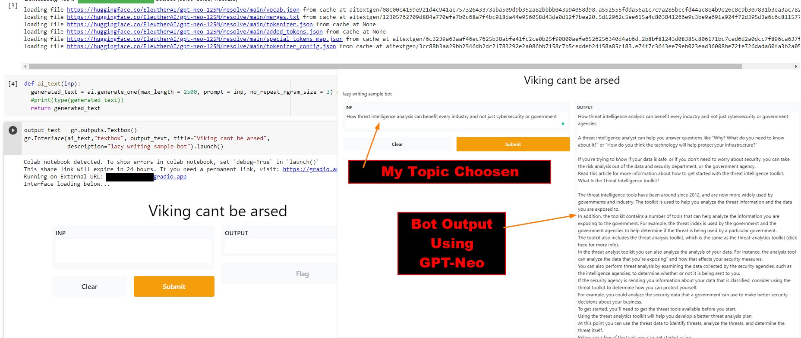

# Text Generation Bot

So I got lazy and wrote this at 1am after being asked to write a 5 page 2500 sample writing paper, I looked at the clock and went "eh cant be arsed" and decided to put togther these couple of lines of code to do it fore me. it uses gradio for nice looking commend in and out altough can be done from the command line I just like when it looks fancy in gradio. This is using 125m data set for GPT-Neo you can easy change this if you look at the code, the bigger the dataset = the longer to download "duh"

**NOTE A:** I am not a bot dev or AI dev know anything needed to make this better

**NOTE 2:** this will probably run better if you copy and paste it into a terminal instead of running it as a script

**Note C:** Use GPU other wise this can take anywhere up to 30 minutes on CPU... 

## Required Installs
- gradio =  **!pip install -q gradio**
- aitextgen = **!pip install -q aitextgen**

